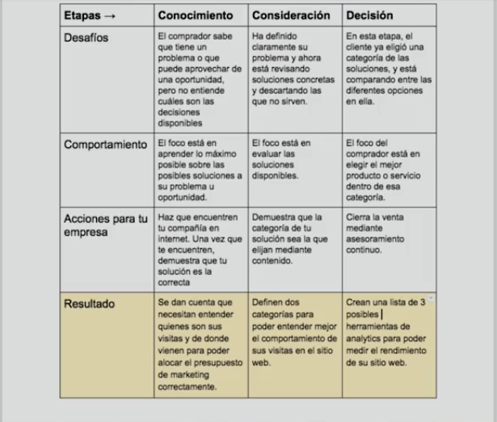
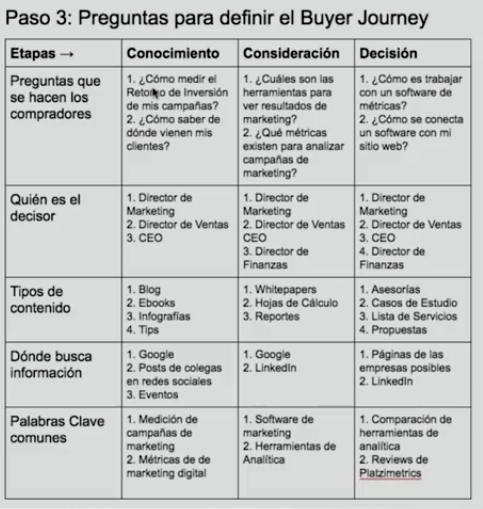
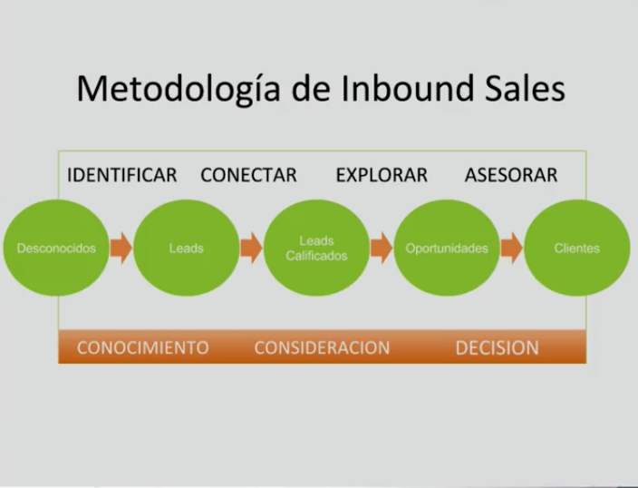
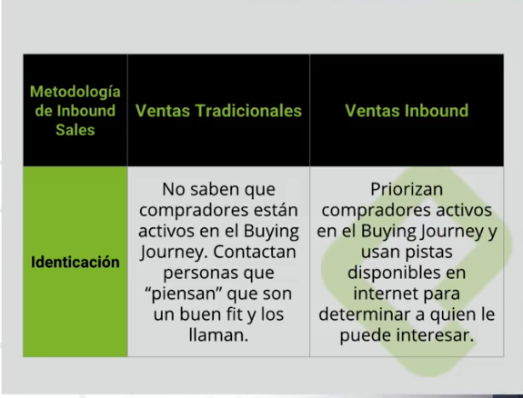

# El proceso de Ventas escalable

Profesor: Daniel Patiño [@thisisdanpatino](https://twitter.com/thisisdanpatino)

## Inbound Sales: Implementando un proceso de ventas escalable

En este curso veremos:
- Introducción
- Buyer Journey: Ciclo de ventas desde el punto de vista del comprador.
- Proceso de ventas: Que acompañe a nuestros clientes potenciales. Lo que sucede normalmente en las empresas es que se enfocan en su proceso de ventas y luego colocan a sus compradores encima de él. Aquí la idea es trabajar de manera inversa.
- Ideal Buyer Profiles: Perfil o el fit de una empresa que tiene un encaje con nuestro servicio o producto. Aplica si es B2B.
- Buyer personas: Esto es para B2C, venta a consumidores.
- Secuencias: Una metodología para automatizar y mejorar la productividad de nuestro equipo de ventas o si eres solamente un vendedor en la compañía, de cómo agilizar y no dedicarle tanto tiempo a tareas administrativas.
- Frameworks de clasificación de leads: Priorizar esfuerzos de ventais. Porque cuando generamos muchos contactos o clientes potenciales como para manejarlos a todos al mismo tiempo como para calificarlos y solamente contactar aquellos que puedan convertirse en un vendedor. Y dejar lo que no están muy calificados para el final.
- Método de cierre de ventas: Puede ser una demo, una presentación o un documento.

Para una empresa ficticia llamada Platzimetrics

## ¿Qué son Inbound Sales?
El proceso de ventas tradicional ha estado siempre enfocado en la relación entre un vendedor y un comprador. Sin embargo, el objetivo de ele proceso inbound de ventas es cambiar esa idea. La relación debe estar dad en términos de consulta, como lo que pasa entre un doctor y un paciente.

Debemos ser capaces de ofrecer a nuestros clientes un asesoramiento para alcanzar sus objetivos o solucionar su problema. En este curso nos enfocaremos en que nuestros clientes encuentren en nosotros la mejor opción para solventar la necesidad en la que podemos ayudarles.

---

> La idea es que nos vean más como asesores y no como vendedores.

> ***Mito***: Las ventas no se puede enseñar con una metodología escalable.

***¿Qués es Inbound Sales?*** Cuando un médico te pregunta acerca si fumas o enfermedades genéticas de tu familia, tú no le vas a mentir porque el título pegado en la pared genera confianza. Tú no pides descuentos u otras opciones, tomas las pastillas que te dijeron y listo.

Estadísticas Outbound (Marketing pagado):
- 86 % se salta los anuncios de la tv
- 91 % elimina sus suscripciones a newsletters
- 87 % de los correos masivos no son abiertos
- 200 M contactos son clasificados como "no deseados"

Debemos entender a los compradores y saber cómo sus gustos han cambiado.

Internet cambió la forma en cómo los compradores y vendedores interactúan.

***Inbound Sales*** Transformas las ventas.

Dos filosofías:
- Los equipos de Inbound Sales crean toda sus estrategias de ventas pensando en el comprador en vez de en el vendedor

- Los vendedores Inbound personalizan toda la experiencia de ventas al contexto de cada comprador. No aplicamos el mismo pitch o plantilla, sino que nos personalizamos a cada uno de nuestros compradores.

Inbound Sales va a portar una ventaja competitiva y va a crear un proceso de ventas que tus compradores van amar.

## Los 3 elementos del Inbound Sales
Vamos a crear el Inbound para PlatziMetrics donde es una StartUp que se especializa en hacer marketing a través de datos para otras empresas.
1. Buyer Journey
   - Descubrimiento de problema: Todo comienza cuando descubre que tienen un problema, es decir, que tal vez siente que no está logrando el objetivo de ventas que tal vez no puede calcular el retorno de inversión de las campañas de marketing. Está consciente del problema pero no sabe qué soluciones existen en el mercado. La idea es tener una lista de contacto o problemas que han demostrado interés en resolver ese problema.
   - Educación sobre el problema: Las empresas están buscando en internet, cómo calcular el retorno de inversión o bien en Linkedin preguntándole a sus colegas.
   - Averigua posibles soluciones: Están pensando soluciones posibles, tal vez contratar un consultor para calcular el retorno de inversión o bien hacer un curso ellos mismos.
   - Creando lista de soluciones posibles
   - Prueba una de las soluciones: En el caso de PlatziMetrics prueban una demo
   - Análisis del Retorno de inversión: De que si tiene sentido en invertir en esta herramienta o no
   - Negocia contrato final: Deciden si compran la herramienta o no.

> ***Nota*** Todo está enfocado en el comprador y no en nuestro proceso de ventas.

2. Etapas del proceso de ventas (El proceso interno de nuestras ventas)
   - Etapa de Identificación: Lo importante es priorizar nuestros esfuerzo de ventas y priorizar los lets que han demostrado más interés.
   - Etapa de conexión: Hacer que nuestro equipo de ventas entren en contacto con nuestros lets (usuarios ideales) que fueron identificados en la etapa anterior.
   - Etapa de exploración: Ver los desafíos, objetivos, consecuencias de nuestro producto. Nos vamos a enfocar en identificar cuáles son las necesidades de nuestros clientes potenciales.
   - Etapa de asesoramiento: Le brindaremos una solución para el problema que están teniendo.

3. Matrix de calificación: 

Framework a utilizar: GPCTBACI (Objetivos, planeamiento, desafíos, tiempo (urgencia a solucionar el problema), presupuesto, autoridad (¿Estamos hablando con el que firma el contrato?), Consecuencias de no hacer nada al respecto (¿Qué pasa si no contratan a PlatziMetrics?, costo de inacción), retorno de inversión)

## El Buyer Journey

El vendedor tradicional:
- Hacer Prospecting (comprar una base de datos y enviar emails masivos)
- Realizar una Demo: Ejemplo enviar una demo de un producto no solicitado hablando de lo bueno que es el demo sin antes saber si resuelve mis problemas o si es algo que estoy buscando o no.
- Cerrar la venta: Llamando o enviando un contrato.

Notar que en ningún momento estamos pensando en las necesidades del comprador.

***Ṕara hacerlo con Inbound Sales***
- Cómo conocen tu producto: Blog, noticias, un amigo...
- Cómo evalúan tu producto: Cómo evalúan diferentes categorías de los productos.
- Cómo compran el producto: Contrato, plataforma de e-commerce...

***Etapas***
- Conocimiento: Los compradores identifican un problema en la empresa o bien un objetivo que quieran lograr y definen si realmente tiene sentido abarcar el problema. Preguntarse:
    - ¿Cómo describen sus objetivos y desafíos los compradores?
    - ¿Cómo se educan sobre estos objetivos y desafíos?
    - ¿Cuáles son las consecuencias de la inacción? Es decir, no alcanzar esos objetivos o protegerse de esos desafíos
    - ¿Hay ideas equivocadas sobre cómo alcanzar esos objetivos o desafíos?
    - ¿Cómo deciden los compradores si ese objetivo o desafío se le debe dar prioridad?

> Respondidas estas preguntas del comprador, sabremos si nuestro potencial comprador necesita de nuestros servicios.

- Consideración: Los compradores han definido los objetivos, y definieron como prioridad. Preguntas:
    - ¿Cuáles son todas las categorías de soluciones que investigan los compradores?
    - ¿Cómo se educan los compradores en relación a todas las categorías que existen?
    - ¿Cómo perciben los compradores los pros y los contras para cada categoría?
    - ¿Cómo deciden cuál categoría es la correcta para ellos?

> Nota: Categoría se refiere a distintos proveedores de ese mismo servicio.

- Decisión: Una vez definimos qué canales usar y qué tipo de contenidos usar, ya estamos listos para pasar a la etapa de decisión. Aquí los compradores definieron las categorías que consideran solucionarán sus problemas. Preguntas:
    - ¿Cómo evalúan las soluciones disponibles?
    - ¿Qué les llama la atención en comparación con otras alternativas?
    - ¿Quién debe estar involucrado en la decisión?
    - ¿Necesitan probar tu solución antes de comprar?
    - ¿Piensan en el entrenamiento a su equipo, costos de implementación, u otros factores adicionales?

## Creando el Buyer Journey de PlatziMetrics

***Aquí descargar la plantilla que está en los archivos***

Es importante que toda la empresa esté consciente de ese documento.



***Debemos hacer que nos encuentren cuando busquen en internet cuando están haciendo la búsqueda*** 

Debemos saber si nuestro cliente potencial consume más vídeos.

Entre las opciones son generar un blog y crear contenido para que nos encuentren, como vídeos etc. Todo adaptado a los gustos de nuestros clientes potenciales.

En el archivo hay un cuadro interesante. Le he tomado una captura.

Debemos crear plantillas y contenidos que demuestren al cliente que podemos ayudarles a solucionar sus problemas.

Los casos de éxitos y testimonios ayudan mucho a que el cliente nos elijan.

## Cómo definir el buyer
En este punto debemos respondernos las preguntas


***Decisor*** Es quienes toman las decisiones en primera instancia y luego el proceso de consideración y son estas mismas las que tomarán la decisión de comprar el ebook.

Podemos escribir artículos y en ellos dejar algún ebook en el que se puede descargar al dejar un email y enviar por correo.

El contenido crearlo basado en las problemáticas de las empresas que sean clientes potenciales. De esta forma se sentirán identificados.

Usar palabras claves que nos ayuden con el SEO.

## Resultado Buyer Journey
Estas son etapas accionables para que el equipo de vendedores identifiquen en qué etapa se encuentra nuestros clientes.

Aquí se usa la herramienta Hotspot, en internet. Hay una versión gratuita. Cada columna es una etapa, cada cuadrito es un cliente.

# Proceso de ventas
## El proceso de ventas
Las dos filosfías de Inbound Sales:
- Los equipos de Inbound Sales crean toda sus estrategias de ventas pensando en el comprador en vez de en el vendedor.
- Los vendedores inbound personalizan toda la experiencia de ventas al contexto de cada comprador.



- Identificar: El vendedor ser preocupa por identificar desconocidos que encajen con un fit del cliente ideal. Si ven que tienen un fit pasan a la etapaa de conexión.
- Conexión: Si el vendedor identifica que hay una necesidad en ese cliente entonces se convierte en el let calificado.
- Exploración: El vendedor explora junto al comprador si la solución de nuestra empresa tienen un encaje con el objetivo o la necesidad que ellos tienen. No estamos vendiéndole nuestro producto, se trata de entender su problemática y saber si nosotros podemos ayudarle.
- Asesoramiento: Recomendamos nuestra solución como la ideal para sus objetivos o problemas que tienen. Si a la persona le interesa se convierte en cliente.

> Siempre ten en cuenta a tu comprador mientras creas el proceso de ventas.



**Identificación***
Los vendedores tradicionales, contactan personas que "piensan" que son un buen fit y los llaman.

Los vendedores Inbound, investigan a sus potenciales clientes en búsqueda de pistas de si están buscando una solución como la que ofrecemos nosotros.

***Conexión***
Los vendedores tradicionales, envían emails y hacen llamadas en frío on el mismo guión y con la mismo info disponible en internet. Sin que el posible cliente lo esté esperando.
> Toda la información que un vendedor te puede ofrecer por teléfono es muy probable que la encuentres por internet.

Los vendedores Inbound: Comienzan con un mensaje personalizado al contexto del comprador. Generan interés genuino a través de las pistas, por ejemplo "¿qué te pareció nuestro blog?" porque ya sabemos que leyó nuestro sitio web.

***Exploración***

Vendedores tradicionales: Cuando el cliente muestra interés, los vendedores les muestran una presentación genérica y explicando todos los módulos de su software perdiendo tiempo en explicar cosas que al cliente no le interesa.

Vendedores Inbound: No le muestra el producto, pero empieza una exploración de los objetivos y problemas del cliente potencial para descubrir objetivos ocultos y crear una presentación personalizada.

***Asesoramiento***

Vendedores tradicionales: Hacen la misma presentación y usan los mismos casos de éxitos para todos. Se ponen en piloto automática. No les importa si la empresa es de automovilismo, mobiliaria y sin importar de que la empresa se relacione con ese caso de éxito.

Vendedores Inbound: Hacen cada presentación personalizada haciendo uso de la información en todo el proceso de ventas. De nada sirve mostrarle todos los servicio de nuestra empresa ni todo lo que hacemos si solo vamos a ofrecerle solo dos módulos. Si el cliente es de la industria inmobiliaria o del mismo país que otros casos de éxitos podemos generar confianza y convertirlo en nuestro cliente.

***Presentaciones tradicionales***
- Presentación: Genérica, la misma para todo el mundo.
- Demo: Muestran todas las herramientas o todo el servicio o producto
- Caso de éxito general.

***Presentaciones Inbound***
Todos para ese cliente potencial
- Presentación personalizada
- Demo
- Caso de éxito personalizado

> "Inbound Sales" Transforma las ventas para que se alínien a la manera cómo tus clientes compran hoy en día.

## Introducción: Etapa de identificación
Debemos definir nuestro perfil de comprador ideal.

***Métodos tradicionales***
- Compran listas, bases de datos, envían miles de emails esperando a que uno responda.
- Buscan en LinkedIn miles de contactos, pero no buscan si están en a etapa de Buyer Journey en el que están buscando resolver una necesidad.
- Los contactan inmediatamente y comienzan en la Etapa de Conexión con propuestas genéricas saltándose todas las etapas.

***Triggers de identificación***
- Visitas al sitio web: Podemos saber cuáles empresas mediante la dirección IP que están en nuestro sitio web.
- Llenaron un formulario donde dejaron sus datos de contacto para descargar un material.
- Abrieron un mail de la compañía como una suscripción a nuestro newslletter y lo abrieron
- Social Selling: Cómo usar las redes sociales para entrar en contacto con nuestros clientes potenciales.

***Proceso para crear nuestra Etapa de Identificación***
- Define tu Ideal Buyer Profile: Perfil de comprador ideal
- Identifica los leads que son acordes a tu Ideal Buyer Profile.
- Enriquece a tu lead con contexto de las pistas que encontramos.

## Ideal Buyer Profiles
Es importante definir el perfil de nuestro comprador ideal porque cuando estemos buscando clientes potenciales debemos saber cuáles encajan con nuestro cliente ideal.

Es importante que si nuestra empresa es B2B va a estar a nivel de compañía. Si es B2C, establecer las características y los individuos de los individuos.

***Preguntas para definir tu Ideal Buyer Profile***
- ¿Cuál es el tamaño ideal de al compañía?: En base a empleados, ingresos, países donde están presentes, cantidad de clientes.
- ¿Cómo defines el tamaño?: Estará respondida con la pregunta anterior.
- ¿Cuál es la vertical ideal para tu negocio y cuáles son las verticales que no lo son?: Verticales son empresas de servicio etc.
- ¿Cuál es la zona geográfica ideal?: Si tu contenido es en español entonces te enfocas a latinoamérica, españa.
- ¿Hay algún otro atributo que hacen que un cliente sea ideal o no ideal?: Como un departamento grande de recursos humanos grandes, etc.

Para PlatziMetrics
Ideal Buyer Profile:
- Industria: Telecomunicación
- Tamaño: 200+empleados
- Región: LATAM

Buyer Personas: (Con quién queremos hablar de la empresa)
- CEO
- Director de Ventas
- Director de Marketing
- Analista de Marketing (Porque es el que le estará vendiendo nuestro producto a su jefe)

## Identificación  de leats Inbound
El primer paso es monitorear los potenciales clientes identificados en el paso anterior, es decir, cuáles están posteando en las redes sociales y cuáles están buscando información nueva.

Y es aquí donde se diferencia los vendedores Inbound de los que no lo son, sabiendo quiénes están activos y quiénes no lo están.

***Maneras de saber quiénes son compradores activos***:
- Leads Inbound: Son las personas o contactos más activos, que visitan tu sitio web o dejan sus datos para descargar algo de tu página web. Es importante contactarlos de inmediato y darles prioridad por encima de cualquier otro comprador porque ya te están mostrando interés.
  - Con un formulario  podemos hacer que dejen sus datos de contacto y nos lleguen una notificación.
  - Con un CRM, en Hostpot tienen uno, se pueden filtrar en base semanas, meses, etc. De tal forma el departamento de vendedores estarán mas enfocados en saber quiénes están más interesados en resolver su problema.
   - Con ese CRM, llega notificaciones en tiempo real a los vendedores para que puedan contactar inmediatamente.
   - No pedir información muy personal porque tal vez no se la van a dejar.
   - Hay filtros avanzados, como por ejemplo que no sean hotmail o gmail sino emails corporativos. Ya que su cliente ideal es B2B.
   - En vez de tener una base de datos de miles de personas, el profesor tiene una de 300 contactos que señala ser mejor por ser más manejable.
   - Se pueden descalificar los que no tienen fit, por ejemplo una lista de ***¿Con cuál puesto te identificas mejor?*** Emprendedor, Analista, Gerente, Estudiante... De esta forma se pueden optimizar los filtros en base a los intereses.

- Compañías Inbound: ¿Qué pasa si es una compañía la que entra a nuestro sitio pero no deja ningún formulario? El 95% de tus visitas no llenan el formulario. Esto significa que no están activos  en el proceso de Buyer Journey. Entonces cómo tratamos de aumentar de la tasa de conversión de 5% a un nivel más alto.
  - Utilizando Hostpot podemos saber qué empresas, mediante la dirección IP, estuvieron en el sitio web. Pero tal ves no dejaron información, una vez que identificamos que tiene un fit las contactamos proactivamente. Podemos saber qué páginas visitó, qué artículos leyó y de esta forma tenemos buen material para entrar en contacto.
  - Si no tenemos contacto alguno de la compañía, buscamos en google, en LinkedIn, definimos a quién nos interesa contactar en la empresa y lo buscamos en LinkedIn. Quizás el gerente de Marketing, Analista o quizás el CEO.

- Trigger Events (Eventos disparadores):
  - Menciones de nuestra empresa en Twitter
  - Empresas de nuestra industria (#) en Twitter
  - Entrar a las redes sociales de las empresas. Ejemplo: Al entrar en la red de Platzi, vemos que tienen una conferencia. Hablamos respecto a esa conferencia para generar algo de confianza, ***no*** vamos de una a venderle nuestro producto.
  - Notas sobre la compañía: Quizás salieron a la bolsa, nuevos empleados, nuevo empleado... 

***Social Selling***: Cómo interactuar en las redes sociales para interactuar con posibles clientes.

Técnicas:
- Influenciadores: La idea es conectarse con personas expertos en la industria, hablar con ellos y conectarse para que te relacionen y te empiecen a conocer dentro de tu mercado.
- Grupos en LinkedIn: Pertenecer a grupos en LinkedIn de ese mercado o bien cualquier otra red social.
- Blogs de otras compañías: Blogs de las compañías de la industria. Hagan comentarios, eso lo reciben siempre muy bien. Porque si te hacen un comentario sabes que lo están leyendo y si lo haces a otros te lo van a recibir de una muy buena manera.
- Blog de tu compañía: Traten de dedicarle mucho tiempo a generar contenido en internet. El comprador cambió la manera de cómo comprar productos, ahora es muy dependiente de google cuando esté interesado. Es mejor que consiga información de nuestra empresa que nosotros demos este contenido gratuito, que estemos educando a nuestro cliente potencial y nos vean como expertos en nuestra industria que no encuentren en nuestra competencia. ***Entonces si sienten que no tienen tiempo en generar contenido para su blog***, un tip del profesor es apartar ***4 horas*** o empezar con 2 horas, a la semana para aplicar a una de estas cuatro opciones. Y de esta manera generamos mucho contenido. 

> La idea es que el primer contacto sea con un tema que le interese al cliente objetivo.


## Enriquecimiento de Leads con contexto

Enriquecimiento de un lead (cliente potencial), consiste en generar más data del mismo para realizar.
- Formulario
- Contenido de mi sitio web: En Hotspot dice lo que leyó, lo que descargó a qué hora, todo por la IP.
- Seguimiento de Emails, en Hotspot dice si abre los Emails,
- Canales: De dónde vino, posicionamiento orgánico, vienen de facebook.
- Interacciones en redes sociales de nuestra compañía.
- Información pública: La trae automáticamente del CRM, Nombre, url linkedin, números de trabajadores, ingresos, etc...

***Información que se debe obtener***
- Título y rol (cargo)
- Industria donde se desenvuelve
- Tamaño de la compañía (presencia en países, cantidad de empleados)
- Lugar geográfico
- Longevidad del contacto dentro de la compañía (qué tan comprometido está con la compañía y cuántos años tiene)

> Información que sí o sí debe tener el equipo de ventas.

***Proceso para crear nuestra etapa de identificación***
- Define tu Ideal Buyer Profile
- Identifica los leads que son acordes a tu Ideal Buyer Profile
- Enriqueces a tu lead con contexto (Google Directives)

***Hasta aquí la etapa de identificación***

## Ejercicio práctico: Etapa de Identificación

***Aquí descargar la plantilla de los archivos***

PlatziMetrics comenzará a latinoamérica, Asia y Europa *No los podemos ayudar por los momentos*

## Introducción: Etapa de conexión
Aquí es donde interactuamos por primera vez con nuestros clientes potenciales.

Los vendedores tradicionales: Usan emails masivos y llamadas masivas. La tasa de contacto es menor a 5% y la de cerrar la venta es mucho menor.

> 42% de los vendedores dicen que lo más difícil de vender es hacer prospecting. Según encuesta realizada por HubSpot en el "State of Inbound" Report.

El uso de las herramientas Inbound es para que sea una charla en vez de una venta.

Vendedores Inbound, hablan de:
- Objetivos: Que tiene este posible cliente
- Planes: Que tiene de 1 año, 2 ños o 5 años. Que tienen que ver con la solución que el vendedor provee.
- Desafíos del comprador: Por qué piensan que necesita el vendedor Inbound

> La idea no es vender en este momento, sino saber si el cliente potencial tienen una necesidad que necesitan satisfacer.

Podemos utilizar información obtenida en la etapa de identificación:
- Industria
- Rol dentro de la empresa
- Intereses
- Conexiones mutuas
- Interacciones

¿Qué buscan tus clientes potenciales?
- Comienzo del embudo (75% del tráfico de web): ***Etapa de conocimiento*** Información general para educar a nuestro potencial cliente (ebooks, guías, eventos y vídeos)
- Medio del embudo (22% del tráfico web): ***Etapa de consideración*** Información general de los servicios o productos (casos de estudio, spreadsheets (hojas de cálculo), plantillas) Material general pero sin hablar de pricing.
- Final del embudo (3% del trafico web): ***Etapa de decisión*** Información específica (1 asesoría gratuita, una demo, una llamada con un vendedor).

***Recuerden*** Cuando hacen la llamada de conexión, tus compradores potenciales se encuentran en la etapa de conocimiento, así que el  seguimiento puede ser enviarles un libro digital.


## Definición de Buyer Personas
En PlatziMetrics, necesitamos contactar con:
- CMO (Director de Marketing)
- CTO (Director de tecnología)
- CEO (Dueño de la compañía)

En todos debemos crear contenido para cada una de las industrias donde se desenvuelva nuestro Ideal Buyer Profile, enfocado en cada contacto (3 por cada industria).

***Desarrollo del Buyer Persona***
- Objetivos y desafíos: Que ellos tienen reales hasta con nombres y fotos, los desafíos día a día, los objetivos dentro de la empresa. Tal vez tienen un jefe al que tienen que reportar o un equipo al que tienen que dar soporte.
- Educación: Cómo se educa esa persona diariamente, acostumbran a leer blogs, van a eventos presenciales, etc. Todo esto porque el contenido que consideremos relevantes deben estar en los canales adecuados.
- Implicaciones: De no o de sí lograr los objetivos, las remuneraciones que ello implica. Todo esto te ayuda a entender el día a día de estas personas y cuando estés hablando con estas personas sepas con quién lo haces y cómo debes hacerlo.
- Ideas erróneas comunes: Que tienen sobre tu solución y sobre la industria, esto ayudará a saber cómo comunicarte con las personas.

***En PlatziMetrics***
El CEO, CMO, CTO, con foto, nombre, empresa, cargo, etc. Todo esto para que cuando el equipo de ventas entre en contacto sepan toda la información que necesitan para saber con quién están hablando.

## Secuencias y contenido de secuencias
Estas son las acciones que vamos a tomar para entrar en contacto con las personas.

Define:
- Canales (email, red social, llamada, etc)
- Cuando (horario y hora)
- Frecuencia (Después de un primer intento fallido cuándo y cómo volverlo a intentar. Después del 2 intento la tasa de respuesta aumenta hasta el 6 intento)

En PlatziMetrics: 5 veces durante las dos primeras semanas. Canales: Email, teléfono, redes sociales y blog. Como es B2B de 9am a 5pm. Si no responde la llamada le enviamos un email y le hacemos un retweet. Hay maneras de automatizar el proceso


***Contenido***: En base a plantillas por cargo y por industria pero personalizando nombres.
- Tipo de organización
- Rol de la persona
- Etapa del Buyer Journey

> No armar un email armando la descripción de la compañía expresando lo increíble que eres (eso se hace después). Lo primero es educar al cliente, demostrarle que estás aquí para ayudarlo, entender sus problemas y no venderle otro producto más que seguro vio 10 emails ants que el tuyo con ofertas de productos o servicios similares.

- Inventario de contenido actual.
- Contenido ideal (Que recibe la persona que recién contactas). Ejemplo, si recibes alguien de ventas en tecnología podríamos enviarle un ebook "¿Cómo aumentar tus ventas en la industria tecnológica?". Es posible le guste el contenido y que nos agradezca entregarle algo tan valioso para él o ella.
- Contenido de terceros: Tal vez no tengas los recursos para crear contenido, en ese caso puedes usar contenido de terceros que sean de utilidad.
- Contenido intangible: Puede ser una asesoría gratuita. Ejemplo si es de algún sitio web puedes darle unos tips para indicar cosas que no están haciendo de la mejor manera.
- Personaliza el título: Debajo de 200 palabras, ***menciona al contacto dos veces más de lo que te mencionas a ti mismo***. Pregunta por sus desafíos, objetivos y procura ese ratio de 2 a 1. 

> ***Siempre termina el email con una pregunta, si lo haces, la tasa de respuesta es mayor*** Siempre termina con una pregunta que de pie a una respuesta bilateral.

***Recuerda*** En un primer contacto la idea es ***ayudar, ayudar y ayudar***. Para aumentar la tasa de apertura personaliza el título. La mayoría de las herramientas de email marketing te permiten hacerlo, chequea los nombres de la base de datos para que no se note que sean emails automatizados. Por ejemplo las letras en mayúsculas. 

Piensa en métodos no tradicionales para establecer contacto, por ejemplo de webinar y luego escribirle un email conversando acerca de es webinar o te unos tips que puedan mejorar desde un lado educativo y no de venderle.

## Tipos de prospectos
- Leads Inbound: Son los más fáciles porque llenaron un formulario en nuestro sitio web. Podemos llamarlo o enviarle un Email dependiendo de cómo definimos la secuencia. "Detectamos que descargarte nuestro ebook de retorno de inversión. ¿Qué te pareció? ¿Qué dificultades estás teniendo para calcular el RO de tu compañía". De esta manera la persona va hablar de sus objetivos y desafíos.
- Compañías Inbound: Son las compañía que entran en tu sitio web, es igual a los Leads pero con la diferencia de que no sabes quién es el contacto de la compañía. En este caso, buscamos por linkedin al personal que pudiera haber hecho la conexión, en este cas CMO. El email podría ser algo como: "Vimos que alguien de tu compañía o de tu empresa estuvo buscando información acerca de cómo calcular el retorno de inversión de marketing. Eso suena algo como que están buscando hacer en el corto plazo". Y allí empezar la conversación.
- Trigger Events: Eventos disparadores, el cliente o contacto posteó algo en linkedin sobre un puesto laboral como que están aumentando su presupuesto y allí como "vimos que tienen abierto un puesto en linkedIn  de un personal de Marketing, ¿están calculando el retorno de inversión de sus campañas?"
- Conexiones en común: Estas son las ***intros***. Referidos de clientes actuales que estén felices y pedirles que te refieran.

## Creando el Buyer Personas de PlatziMetrics

***Aquí hay una plantilla para descargar en archivos***

Es importante llevar esto a papel y no solo en tu cabeza para que cuando alguien nuevo llegue a la empresa el haces entrega de este documento.

- Nombre, Nacionalidad, canales de redes sociales, Lugar de residencia, metas, rango de sueldo, edad, retos (Retos) [cuando el generador se queda sin ideas para contenido, lee esta plantilla y le surgirán ideas] , ¿qué podemos hacer? (servicios que podemos ofrecer acorde a las metas en base al buyer personas), objeciones comunes (saber cuáles son las cosas que siempre surgen durante las llamadas, las preguntas normalmente hacen durante una reunión personal), mensaje de mercadeo.

Una vez armado toda la información lo subimos a una herramienta tecnológica como HubSpot. También añadir su historia dentro de la empresa, lo que hace, gustos, etc.

## Creando las secuencias de PlatziMetrics

Podemos llenar las plantillas y entregarlas en la plataformas para obtener feedback de cómo las estamos armando.

***Aquí plantilla de las secuencias en los archivos***

Cuando conocemos a alguien en un evento, haremos conexión por email (tarjetas de negocio) con Follow Up.

Las demos pueden ser una reunión.

Si no me contesta continuar en una frecuencia definida hasta contestar.

También está el contacto perdido.

Hay una tabla.

Ejemplo de un email:
```
Hola Pablo,

Tu artículo de "tierra" me encantó.

Dejé una pequeña pregunta en los comentaros y también lo compartí en mis redes sociales.

Me encantaría escuchar tu perspectiva en el comentario que hice.

Saludos,
Daniel
```

De esta manera estás tratando de generar un vínculo con esta persona y no estás yendo directamente a la venta.
