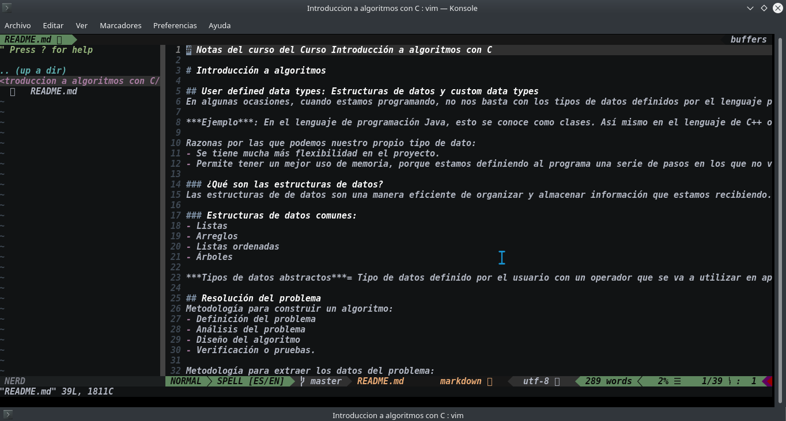

# Notas del curso del Curso Introducción a algoritmos con C

## Configuración vim


# Introducción a algoritmos

## User defined data types: Estructuras de datos y custom data types
En algunas ocasiones, cuando estamos programando, no nos basta con los tipos de datos definidos por el lenguaje previamente, para esto podemos ir definiendo nosotros un tipo de dato propio que vayamos a estar usando en nuestro proyecto.

***Ejemplo***: En el lenguaje de programación Java, esto se conoce como clases. Así mismo en el lenguaje de C++ o C se conoce como estructuras.

Razonas por las que podemos nuestro propio tipo de dato:
- Se tiene mucha más flexibilidad en el proyecto.
- Permite tener un mejor uso de memoria, porque estamos definiendo al programa una serie de pasos en los que no va a tener que procesar nada.

### ¿Qué son las estructuras de datos?
Las estructuras de de datos son una manera eficiente de organizar y almacenar información que estamos recibiendo.

### Estructuras de datos comunes:
- Listas
- Arreglos
- Listas ordenadas
- Árboles

***Tipos de datos abstractos***= Tipo de datos definido por el usuario con un operador que se va a utilizar en aplicaciones.

## Resolución del problema
Metodología para construir un algoritmo:
- Definición del problema
- Análisis del problema
- Diseño del algoritmo
- Verificación o pruebas.

Metodología para extraer los datos del problema:
- Entrada: ¿Qué se necesita para realizar los pasos?
- Salida: ¿Qué datos se obtiene al final del algoritmo?
- Tipos de datos: Pueden ser:
  - Números: Reales, enteros, complejos.
  - Textos: Letras, palabras, frases

***Pseudocódigo***= Son representaciones en nuestro lenguaje natural de los pasos a seguir. Son una etapa intermedia para que podamos llevar nuestro algoritmo a cualquier lenguaje de programación.

## El porqué del análisis de algoritmos

***Los algoritmos resuelven el mismo problema, por lo que debemos saber cuál escoger***

- Análisis en tiempo de ejecución: El tiempo de ejecución entre entregar el input y el output. Diferentes entradas como un vector.

Número de bits en una representación de entrada, ejemplo imágenes, audio, etc.

## Cómo comparar algoritmos y ritmo de crecimiento

Debemos saber que existen buenas y malas métricas para comparar algoritmos

***Malas métricas:***
- Tiempo de ejecución: El tiempo de ejecución va a variar dependiendo del equipo donde se ejecute el algoritmo.
- Número de instrucciones ejecutadas: Una vez tenemos un algoritmo hecho, debemos llevarlo a un lenguaje de programación, lo que significa que va a depender del lenguaje que estemos, el número de líneas de código (instrucciones) que vamos a utilizar.

***Recuerda*** Para hacer un análisis del ritmo de crecimiento, siempre vamos a tomar el término de mayor peso.

> Hay formas buenas y malas de comprar algoritmos en ciencias de la computación

Ritmo de crecimiento, es el análisis con más input. Aquí uso, el algoritmo creado en el curso con 10 datos tomando 23%pasos y otro con 200 datos tomando 7575%pasos

Algoritmos de ordenamiento, de obtener la ruta más corta, cómo crear algoritmos de búsqueda y estructuras de datos. 

Ratio de crecimiento de los tiempos de ejecución en algoritmos.

--- Imagen de ratio de crecimiento de los tiempos de ejecución

## Estructuras de control y estructuras de control secuenciales
Estructuras de control: Nos van a permitir definir el flujo de nuestro programa, ejecutar acciones en la parte del proceso correcta.

***Tipos de estructuras de control***
- Secuenciales
- Selectivas
- Repetitivas

***Estructuras secuenciales***: Son las más básicas, funciona como su nombre lo dice, en secuencia. El programa ejecuta los pasos ordenadamente uno tras otro hasta obtener el resultado y termina.

## Estructuras de control selectivas

***Estructuras selectivas***: Nos van a permitir que nuestro algoritmo o el programa tome decisiones en el caso de ejecutar un pedazo de código o segmento de código o no con bas en una condición específica que debemos verificar si se cumple, y si se cumple ejecutamos la condición y si no, se va colocando lo siguiente de nuestro código.

- Si, if. Aquí vamos a tener una condición, y en caso de que la condición se cumpla vamos a ejecutar un pedazo de código. En caso de que la condición no se cumpla vamos a saltar ese pedazo de código.
- Si-sino, if-else: Nos permite una condición y bifurcar el camino para dos rutas distintas, es decir, si la condición se cumple, ejecutamos una acción y si la condición no se cumple ejecutamos otra acción diferente.
- Si, sino entonces... sino, if,else if, else: Aquí vamos a poder verificar la primera condición, en caso de que esta primera no se cumpla, podemos verificar una segunda condición y en caso de que esta segunda no se cumpla, podemos tener n condiciones. Si este número n que hayamos determinado no se cumplen, al final se ejecutará else (sino).

***Estructuras de selección múltiple***: Estas estructuras nos van a permitir concatenar tomas de decisiones y a final tener una decisión estándar en el caso de que no haya en ninguna de las condiciones.

## Estructuras de control repetitivas
***Estructuras repetitivas***: Estas nos van a permitir crear bucles donde nuestros programas van a estar repitiéndose hasta que una condición les indique lo contrario o mientras una condición les indique que hagamos eso.

- Mientras, ***while***: Mientras una condición se cumpla, nosotros vamos a ejecutar todo el código que está dentro de este ciclo y vamos a repetirlo.
- Haz mientras, ***do while***: Esta instrucción nos permite entrar por lo menos una vez a ejecutar el código que está dentro de esta instrucción y si la condición se cumple, entonces repetimos, pero si la condición no se cumple salimos del código.
- Para, ***for***: Se utiliza cuando necesitamos repetir una sere de veces definida un código.

La diferencia de un ***while*** y un ***do while*** es que el segundo se va a ejecutar por lo menos una vez y el rimero no necesariamente se va a ejecutar, si la condición no se está cumpliendo no va a entrar ni una vez a es código y lo saltaría.

# Lenguaje C
## Introducción al lenguaje C

***Notas:***
- El lenguaje C fue una revolución en su época ya que en ese entonces se utilizaba todavía el lenguaje ensamblador para acceder al lenguaje máquina o para trabajar directamente con el hardware.
- Lo increíble de este lenguaje era que tenía la capacidad de trabajar a nivel de hardware y además estaba optimizado pues era un lenguaje de alto nivel.
- El lenguaje es hoy en día el lenguaje de programación más utilizado en sistemas embebidos y en sistemas de bajos recursos de hardware donde necesitamos el acceso al hardware y donde se necesita mantener muy alto rendimiento.
- El lenguaje C tardó varios años en estandarizarse.
- Un estándar en C significa una serie de guías y directivas que se deben de seguir al momento de escribir tu código que están respaldadas por una asociación (ANSI)-
- La programación estructurada es un método de programación o un paradigma que dice que vamos a ejecutar el código de forma secuencial, línea tras línea, del inicio al fin.
- C es un lenguaje de programación compilado.
- C es un lenguaje tipado.

### Características importantes de C:
- Núcleo del lenguaje simple que opera con bibliotecas.
- Lenguaje flexible que soporta la programación.
- Acceso a memoria de bajo nivel con punteros.
- Utiliza un conjunto reducido de palabras clave.
- Pasaje de parámetros por valor y referencia.

## Estructura general de un programa en C y un hola mundo

Las librerías se importan con <> y las librerías externas con ""

## Tipos de errores y datos en C

Existen 4 tipos de principales de errores en C:
- Sintácticos: Todo lenguaje tiene una estructura definida de instrucciones que vamos a utilizar para indica al programa lo que nosotros queremos hacer. Estos errores son cuando escribimos mal en el código estas instrucciones ya definidas.
- En el enlace: Cuando enlazamos las librerías con nuestro código inicial, puede ocurrir que invoquemos mal una función o o insertemos la librería que necesitábamos, esto a la hora de compilar nos va a arrojar un error.
- De ejecución: Este sucede cuando por alguna razón, mientras el programa está corriendo, alguno de los valores que vamos a utilizar en una variable, genera que haya una operación inválida.
- Semánticos: Es mucho más complicado detectarlos, ya que son los errores que tenemos cuando nuestros programas funcionan bien, se ejecutan bien, corre sin problemas técnicos pero no está teniendo el resultado que nosotros estábamos esperando y la solución no está bien implementada.

Identificadores: Es el nombre que identifica una constante, variable o función.

Reglas para los identificadores:
- Longitud ilimitada, pero se recomienda usar nombres descriptivos pero cortos.
- Deben comenzar con una letra o guión bajo
- No se puede usar números.
- No se puede usar caracteres especiales
- Deben ser únicos en el programa
- Énfasis en la diferencia entre mayúsculas y minúsculas- No se puede coincidir con una palabra reservada del lenguaje o con una función de biblioteca


Tipos de datos en C:
- char: Caracter
- int: Número entero
- float: Número real de precisión simple
- double: Número real de precisión doble

Recomendación: Utiliza lápiz y papel para tratar de simular el programa antes de llevarlo al entorno en el que vas a estar trabajando. 

---

Cuando sabemos que los números serán siempre positivos, usar ***unsigned*** para optimizar el uso de memoria ya que el espacio de los números negativos se adicionan a más números positivos.

## Variables en C

Las variables son una posición de memoria donde se almacena un dato.

Hay dos cosas que se deben definir en una variable:

- ***Nombre***: Esto nos sirve para poder recuperar su valor en cualquier parte del programa que estemos desarrollando.
- ***Tipo***: Es el límite que le damos de almacenamiento de valores.


## Operadores y expresiones en C
***Operadores***: Son símbolos específicos que van a tener una función definida.

Los operadores se dividen en 4 tipos:

- ***Operadores de asignación (=)***: Este nos permite asignarle el resultado de una expresión a una variable dada. Es importante recordar que la expresión debe de usar los mismos tipos de datos que vamos a guardar en la variable.

- ***Operadores Aritméticos***: Estos operadores van a tener un orden o jerarquía en la que se resuelven, los paréntesis nos van a ayudar a que este orden se cumpla para llegar al resultado que se opera.

- ***Operadores Relacionales***: Esto nos van a servir para establecer una relación entre dos números y evaluarla o hacer una comparación.

- ***Operadores Lógicos***: 
  - Siempre nos van a devolver en verdadero o falso, los cuales son denominados valores booleanos.
  - En el lenguaje de programación de C no existen los valores booleanos, por lo que así se definen:
    - Valor verdadero: Cualquier número que sea distinto a cero.
    - Valor falso: Cero
    - Lo convencional es que se utilice ***1 para verdadero y 0 para falso***.

***Importante***:
- Los operadores lógicos o booleans son empleados para comprar dos valores.
- Los operadores lógicos o booleanos denotan una relación entre dos valores.
- Los operadores lógicos o booleanos tienen el mismo nivel de prioridad.

## Ejemplo de operadores en C y reto.

La compilación es:
```
gcc -o operadores operadores.c

// Se corre con

./operadores
```

## Entrada y salida de datos 
La salida de datos estándar tiene 3 aspectos importantes:
- La salida por defecto es de la pantalla.
- Puede ser redireccionado.
- Cuando es redireccionado se utiliza la función printf.

La entrada de datos estándar tiene 3 aspectos importantes:
- La entrada es por defecto en el teclado.
- Puede ser redireccionado
- Cuando es redireccionado se utiliza la función scanf.
 

***Para tomar en cuenta***: Nosotros podemos concatenar tantos valores como queramos.


